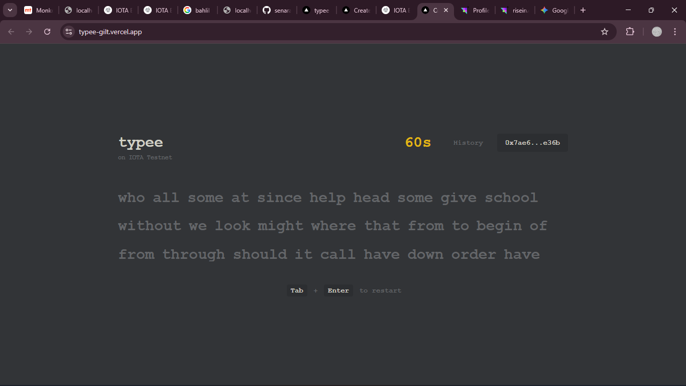
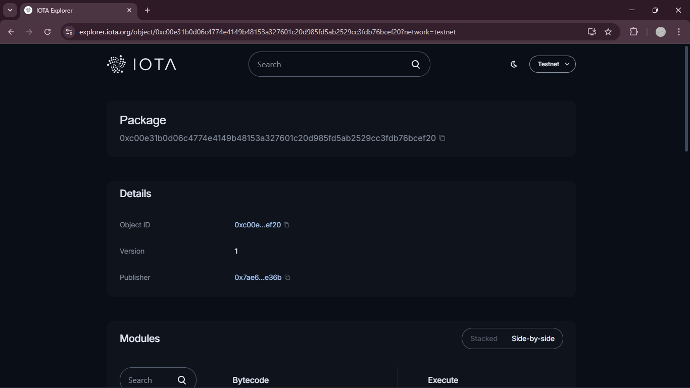

# Typee - On-Chain Proof of Typing




**Typee** is a minimalist typing speed test application built on the **IOTA Blockchain**. Unlike traditional typing tests where scores are ephemeral, Typee allows users to mint their WPM (Words Per Minute) and Accuracy results as verifiable **NFTs (Non-Fungible Tokens)**.

This project demonstrates a practical implementation of **"Proof of Skill"** using Move Smart Contracts and the IOTA dApp Kit.

---

## 🌟 Key Features

* **Minimalist Engine:** A distraction-free typing experience with real-time WPM & Accuracy calculation.
* **Wallet Integration:** Seamless connection with IOTA Wallets via `@iota/dapp-kit`.
* **Mint to Blockchain:** Convert your typing result into an immutable NFT on the IOTA Testnet.
* **On-Chain History:** Fetch and display your entire history of minted scores directly from the blockchain.
* **Verifiable:** Every score has a unique Object ID that can be verified on the IOTA Explorer.

---

## 💡 Use Cases

Why mint a typing score? Typee explores the concept of **On-Chain Credentialing**:

### 1. Verifiable CV & Portfolio (Proof of Skill)
Traditional CVs list skills like "Fast Typer" without proof. With Typee, freelancers, virtual assistants, or data entry clerks can provide a wallet address or Object ID. Employers can verify the authenticity of the skill on-chain, ensuring the data hasn't been tampered with.

### 2. Token-Gated Communities
Communities or DAOs can use Typee NFTs as an entry ticket. For example, a "Speed Typist DAO" could require holding a Typee NFT with >100 WPM to join their exclusive Discord server.

### 3. Esports & Tournaments
Online typing competitions often suffer from cheating (local HTML edits). By executing the logic and minting the result directly through a smart contract, tournament organizers can ensure the integrity of the leaderboard for prize distribution.

---

## 🛠 Tech Stack

**Frontend:**
* [Next.js 14](https://nextjs.org/) (App Router)
* [React](https://react.dev/) (Hooks & State Management)
* [Tailwind CSS](https://tailwindcss.com/) (Styling)

**Blockchain Integration:**
* [IOTA dApp Kit](https://docs.iota.org/dapp-kit) (Wallet connection & Transaction signing)
* [IOTA TypeScript SDK](https://docs.iota.org/iota-sdk) (Fetching objects & RPC calls)

**Smart Contract:**
* **Language:** Move
* **Network:** IOTA Testnet

---

## ⛓️ Smart Contract Details

The logic behind Typee is powered by a Move Smart Contract deployed on the IOTA Testnet.

* **Package Address:** `0xc00e31b0d06c4774e4149b48153a327601c20d985fd5ab2529cc3fdb76bcef20`
* **Module Name:** `game`
* **Function:** `mint_score`
* **Explorer Link:** [View on IOTA Explorer](https://explorer.iota.org/testnet/object/0xc00e31b0d06c4774e4149b48153a327601c20d985fd5ab2529cc3fdb76bcef20)

**Structure of the `Score` Object:**
```move
struct Score has key, store {
    id: UID,
    wpm: u64,
    accuracy: u64,
}